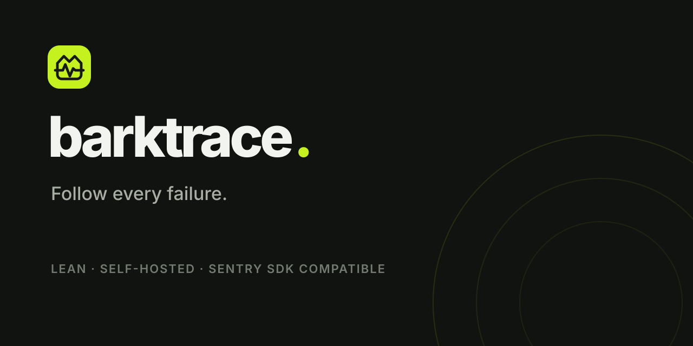

# Barktrace



> Follow every failure.

Barktrace is a memory-conscious, organization-aware observability server. A
single Go process serves the Sentry-compatible API at `/` and an embedded Astro
dashboard at `/ui`.

The current foundation includes:

- SQLite with WAL mode by default, plus PostgreSQL or replicated libSQL for
  external and multi-node metadata deployments;
- generic OpenID Connect login with PKCE, state, nonce, verified-email account
  linking, and automatic organization provisioning;
- organization memberships and project-scoped access;
- member invitations, role administration, and organization-scoped API tokens;
- Sentry envelope and store ingestion with per-project rate limits;
- deterministic issue grouping, event detail, triage activity, and release linkage;
- transaction and span ingestion with latency summaries and waterfall detail;
- sessions and release-health percentages;
- structured log ingestion, filtering, and trace/release correlation;
- bounded Discover queries across errors, transactions, spans, logs, and metrics;
- persisted organization/project dashboards with table, number, and chart widgets;
- scheduled HTTP uptime monitors with check and incident history;
- webhook and Slack alert rules for new issues, regressions, and downtime;
- SMTP email delivery, cron/metric/feedback triggers, conditions, and cooldowns;
- cron check-ins, attachments, user feedback, replay timelines, sampled-profile flamegraphs, and metric ingestion;
- source maps, JavaScript rewriting, ELF/Breakpad debug files, and reprocessing;
- release commits, deploy metadata, code mappings, and suspect commits;
- `sentry-cli` build and snapshot upload/download workflows;
- a durable leased ingestion queue with retries, dead letters, and category quotas;
- organization and project roles plus a queryable mutation audit log;
- configurable retention, manual cleanup previews, and storage reporting;
- an organization-scoped Streamable HTTP MCP server with 37 investigation and dashboard tools;
- optional S3-compatible shared blob storage and leased background workers;
- one final Docker image containing the API and compiled Astro dashboard.

The dashboard lists projects, grouped issues, event counts, and the first and
latest release associated with each issue. Clicking a project switches its
issue and release activity without running a separate frontend service.

## Run locally

```sh
cp .env.example .env
set -a; . ./.env; set +a
go run ./cmd/barktrace
```

Open `http://localhost:8080/ui/`. The API health endpoint is `/healthz`.

Detailed guides:

- [Configuration](docs/configuration.md)
- [Docker, Dokploy, backup, and upgrades](docs/deployment.md)
- [Testing and load gates](docs/testing.md)
- [MCP server and client setup](docs/mcp.md)
- [Sentry SDK compatibility](docs/sentry-compatibility.md)
- [Performance, logs, and uptime](docs/observability.md)
- [Discover queries and dashboards](docs/discover.md)
- [Members, tokens, alerts, and retention](docs/administration.md)
- [Brand identity and assets](docs/brand.md)
- [Architecture and compatibility boundary](docs/architecture.md)

## Pocket ID

Create an OIDC client in Pocket ID with this callback URL:

```text
https://errors.example.com/auth/oidc/callback
```

Set `OIDC_ISSUER_URL` to the Pocket ID issuer, copy its client ID and secret,
and set both `BARKTRACE_PUBLIC_URL` and `OIDC_REDIRECT_URL` to the externally
reachable HTTPS URL. Login is OIDC-only. A new verified identity automatically
creates a user and joins the default organization; the first member is its
owner.

## Docker and Dokploy

Published multi-architecture images are available from GitHub Container
Registry:

```sh
docker pull ghcr.io/barktrace/bark:latest
```

Every push to `main` publishes `latest`, `main`, and `sha-<commit>` tags.
Version tags such as `v1.2.3` additionally publish `1.2.3` and `1.2`.

The image needs one persistent mount at `/data` and listens on port `8080`.
For Dokploy, deploy this repository with its Dockerfile, attach a persistent
volume to `/data`, configure an HTTP health check on `/readyz`, and add the
variables from `.env.example`. The default SQLite mode needs no second container.

An importable production parameter template is available at
`deploy/dokploy.env.example`. Keep one replica with the default local database.
For multiple replicas, use PostgreSQL or shared replicated libSQL together with
S3 blob storage.

The default runtime budget is `128 MiB`, with Go's soft memory limit set to
`96 MiB`. A local production-binary probe measured roughly `13.3 MiB` idle RSS.
Back up the SQLite database with SQLite's online backup mechanism rather than
copying the live WAL file by itself.

## Production-readiness boundary

The current version is functional and deployable with either local SQLite on
one node, PostgreSQL, or replicated libSQL and S3 across multiple nodes. It is
not complete Sentry parity.

The common SDK and `sentry-cli` self-hosted workflows are implemented, but this
is not a drop-in implementation of every Sentry SaaS endpoint. Barktrace now
has a bounded Discover language and custom dashboards; Sentry's complete query
grammar, interactive rrweb playback, the complete Sentry profiling surface, and
Relay remain outside the current boundary.
